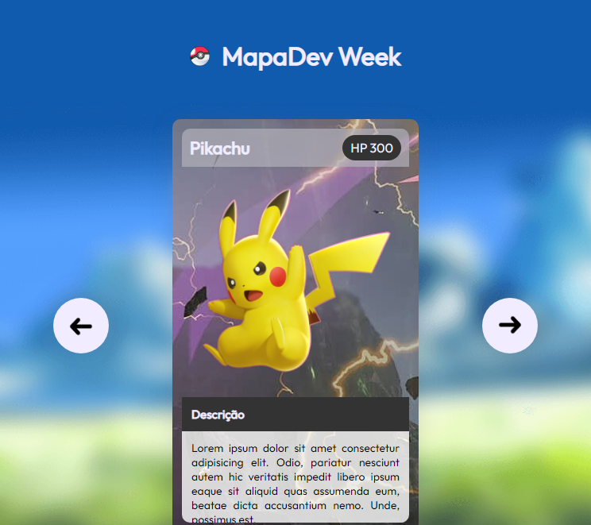

# Carrossel Pockemon

> Mapa Dev Week

Projeto construído no Mapa Dev Week.

[🔗 Acesse aqui](https://bruna-luc.github.io/Mapa_dev/)
## 📚 Tecnologias 
- HTML
- CSS
- Javacript
- GitHub

## Conceitos/conhecimentos utilizados no projeto.

* HTML
  - Utilizado tag básicas 

* CSS
   - Construir a estilização básica dos elementos HTML

* JavaScript 
	- Realiza a implementação do carrossel.
  - manipulação de classes.

* GitHub 
	- Primeiro Projeto completado. Subido no git após a coclusão 

  

## 😁 Contato
bruna.o.fonseca@hotmail.com